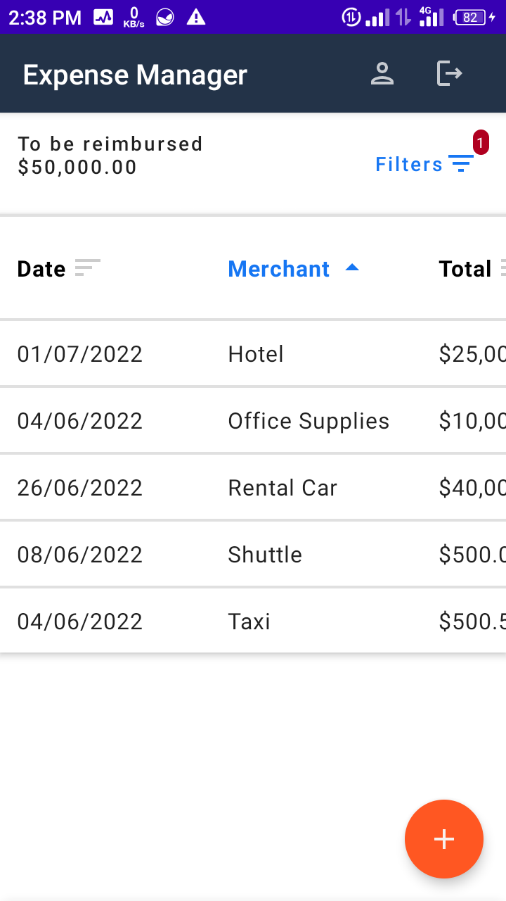
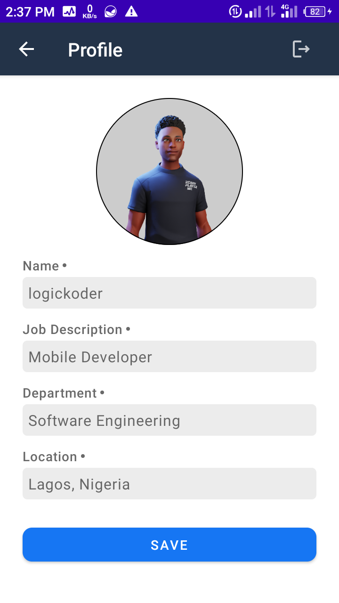

<!-- PROJECT SHIELDS -->
<!--
*** I'm using markdown "reference style" links for readability.
*** Reference links are enclosed in brackets [ ] instead of parentheses ( ).
*** See the bottom of this document for the declaration of the reference variables
*** for contributors-url, forks-url, etc. This is an optional, concise syntax you may use.
*** https://www.markdownguide.org/basic-syntax/#reference-style-links
-->

[![Contributors][contributors-shield]][contributors-url]
[![Forks][forks-shield]][forks-url]
[![Stargazers][stars-shield]][stars-url]
[![Issues][issues-shield]][issues-url]
[![MIT License][license-shield]][license-url]

<!-- PROJECT LOGO -->
 

  <h3 align="center">Expense Manager</h3>

  

    <a href="https://appetize.io/app/nye19v8gw59wkabxjzmk9pdrp0" target="_blank">View Demo</a>
    ·
    <a href="https://github.com/logickoder/expense-manager/issues">Report Bug</a>
    ·
    <a href="https://github.com/logickoder/expense-manager/issues">Request Feature</a>
  

<!-- ABOUT THE PROJECT -->
## About The Project

<table>
<tr>
<td valign="top" width="50%">

</td>
<td valign="top" width="50%">

</td>
</tr>
</table>

Very simple
* You login to the app and add your expenses, every other thing is handled by us

### Built With

The app is build with Jetpack Compose, as it gives me the chance to focus on more concerning issues that styling.
Also the database is implemented with Room Database which is a wrapper of the SQLite DB, Jetpack Navigation,
to handle navigation between screens and Google Accompanist Permissions to easily request permissions at runtime.

* [Jetpack Compose](https://developer.android.com/jetpack/compose)
* [Room Database](https://developer.android.com/room)
* [Jetpack Navigation](https://developer.android.com/jetpack/navigation)
* [Google Accompanist Permissions](https://google.github.io/accompanist/permissions)

(<a href="#top">back to top</a>)

<!-- CONTRIBUTING -->
## Contributing

Contributions are what make the open source community such an amazing place to learn, inspire, and create. Any contributions you make are **greatly appreciated**.

If you have a suggestion that would make this better, please fork the repo and create a pull request. You can also simply open an issue with the tag "enhancement".
Don't forget to give the project a star! Thanks again!

1. Fork the Project
2. Create your Feature Branch
3. Commit your Changes
4. Push to the Branch
5. Open a Pull Request

(<a href="#top">back to top</a>)

<!-- LICENSE -->
## License

Distributed under the MIT License.

(<a href="#top">back to top</a>)

<!-- CONTACT -->
## Contact
logickoder - [@logickoder](https://twitter.com/logickoder) - chukwudumebiorazulike@gmail.com

(<a href="#top">back to top</a>)

<!-- MARKDOWN LINKS & IMAGES -->
<!-- https://www.markdownguide.org/basic-syntax/#reference-style-links -->
[contributors-shield]: https://img.shields.io/github/contributors/logickoder/expense-manager.svg?style=for-the-badge
[contributors-url]: https://github.com/logickoder/expense-manager/graphs/contributors
[forks-shield]: https://img.shields.io/github/forks/logickoder/expense-manager.svg?style=for-the-badge
[forks-url]: https://github.com/logickoder/expense-manager/network/members
[stars-shield]: https://img.shields.io/github/stars/logickoder/expense-manager.svg?style=for-the-badge
[stars-url]: https://github.com/logickoder/expense-manager/stargazers
[issues-shield]: https://img.shields.io/github/issues/logickoder/expense-manager.svg?style=for-the-badge
[issues-url]: https://github.com/logickoder/expense-manager/issues
[license-shield]: https://img.shields.io/github/license/logickoder/expense-manager.svg?style=for-the-badge
[license-url]: https://github.com/logickoder/expense-manager/blob/main/LICENSE.txt
[product-screenshot]: ./screenshots/screenshot-1.png